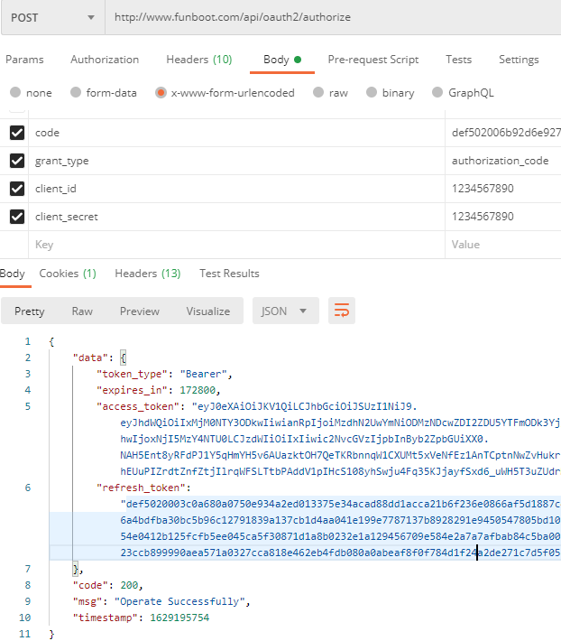

OAUTH 2.0
-----

OAUTH 2.0 enables a third-party application to obtain limited access to an HTTP service, Funboot support 4 grant types.


### Access data after authorized successfully

GET

``` 
/api/oauth/default/profile
```

Header param

Param | Type | Required | default | brief | remark
---|---|---|---|---|---
Authorization | string| YES | - | Bearer + backspace + access_token |


### authorization code

Authorization code is used mostly. The 3rd system redirect to funboot, input username and password(or other type), redirect to 3rd system with code.

Then the 3rd system server use the code access funboot directly. Funboot will return Access Token. The 3rd system will get funboot data by using Access Token.

Step 1. Get Code

Brower redirect to Funboot

GET

```
/auth2/authorize-code
```

Params

Param | Type | Required | default | brief | remark
---|---|---|---|---|---
response_type | string| YES | - | Fixed code |
client_id | string| YES | - | client id | 
redirect_uri | string| NO | - | Redirect Url | If none then using default url
scope | string| NO | - | - | scope of data

If client_id is valid, the login page will display. After enter username and password, the browser will redirect to redirect_url with code.


Step 2. Get Access Token

POST

```
/api/auth2/authorize-code
```

Body Param

Param | Type | Required | default | brief | remark
---|---|---|---|---|---
grant_type | string| YES | - | Fixed authorization_code |
client_id | string| YES | - | client id | 
client_secret | string| YES | - | client secret key | 
redirect_uri | string| NO | - | Redirect Url | If none then using default url
code | string| YES | - | code of step 1 | 



### implicit

Suit for 3rd system without backend server, get from the frontend directly

GET

```
/auth2/implicit
```

Params

Param | Type | Required | default | brief | remark
---|---|---|---|---|---
response_type | string| YES | - | Fixed token |
client_id | string| YES | - | client id | 
redirect_uri | string| NO | - | Redirect Url | If none then using default url
scope | string| NO | - | - | scope of data


### password

Use username and password in a highly trusted environment

POST

```
/api/auth2/password
```

Body Param

Param | Type | Required | default | brief | remark
---|---|---|---|---|---
grant_type | string| YES | - | Fixed password |
client_id | string| YES | - | client id | 
client_secret | string| YES | - | client secret | 
username | string| YES | - | username | 
password | string| YES | - | password | 
scope | string| NO | - | - | scope of data


### client credentials

Suit for 3rd server get data from funboot simply without frontend user to somethings

POST

```
/oauth2/client-credentials
```

Body Params

Param | Type | Required | default | brief | remark
---|---|---|---|---|---
grant_type | string| YES | - | Fixed client_credentials |
client_id | string| YES | - | client id | 
client_secret | string| YES | - | client secret | 
scope | string| NO | - | - | scope of data


### refresh-token Refresh Token

POST

```
/oauth2/refresh-token
```

Body Params

Param | Type | Required | default | brief | remark
---|---|---|---|---|---
grant_type | string| YES | - | Fixed refresh_token |
refresh_token | string| YES | - | Refresh Token | 
client_id | string| YES | - | client id | 
client_secret | string| YES | - | client secret | 
scope | string| NO | - | - | scope of data


### How to generate public and private key in server

```
# openssl genrsa -out rsa_private_key.pem 1024
# openssl rsa -in rsa_private_key.pem -pubout -out rsa_public_key.pem
```

### References

- [RFC 6749](https://tools.ietf.org/html/rfc6749)
- [oauth2 server](https://github.com/thephpleague/oauth2-server)
- [OAuth 2.0 Grant Types](https://www.ruanyifeng.com/blog/2019/04/oauth-grant-types.html)
- [OAuth 2.0 Design](https://www.ruanyifeng.com/blog/2019/04/oauth_design.html)

